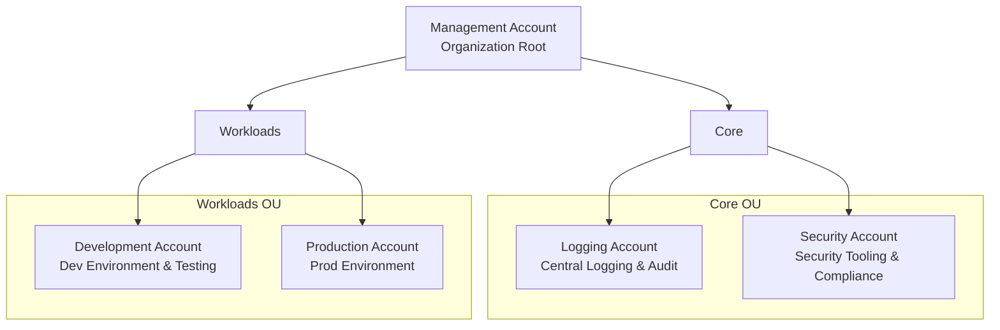
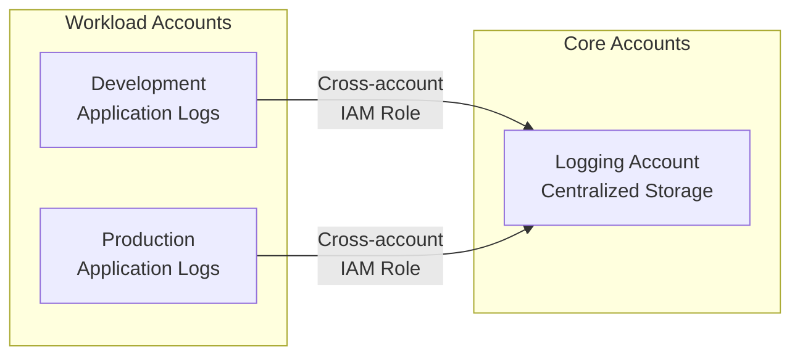
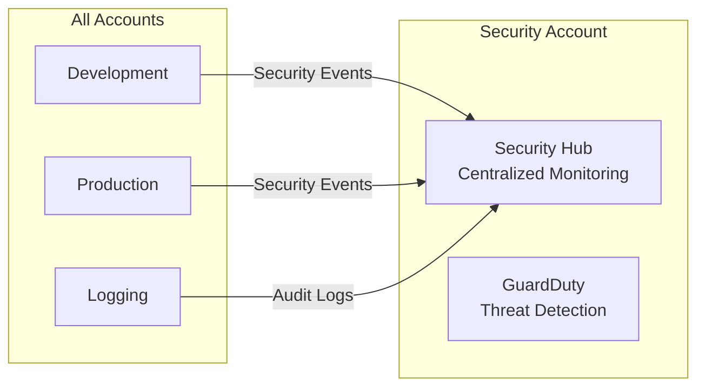

# Multi-Account AWS Organization Architecture

## Overview

This document provides a comprehensive guide for designing and implementing a multi-account AWS organization following AWS Well-Architected Framework principles. The architecture focuses on security isolation, governance, and scalability across development and production environments.

**Prerequisites:**

- AWS Organizations service enabled in management account
- Basic understanding of AWS Identity and Access Management (IAM)
- Familiarity with AWS Control Tower or manual organization setup

This guide establishes the foundation for secure, scalable multi-account governance and prepares your organization for growth.

## Table of Contents

1. [Organization Structure Overview](#organization-structure-overview)
2. [Account Architecture](#account-architecture)
3. [Organizational Units (OUs) Design](#organizational-units-ous-design)
4. [Service Control Policies (SCPs)](#service-control-policies-scps)
5. [Tagging Governance](#tagging-governance)
6. [Cross-Account Access Patterns](#cross-account-access-patterns)
7. [Monitoring and Compliance](#monitoring-and-compliance)
8. [Cost Management](#cost-management)
9. [Scaling Considerations](#scaling-considerations)

## Organization Structure Overview

### High-Level Architecture



### Account Distribution Strategy

| Account Type | Purpose | Environment | Isolation Level |
|--------------|---------|-------------|-----------------|
| Management | Organization governance, billing consolidation | N/A | Complete |
| Security | Security tooling, compliance monitoring | Core | Complete |
| Logging | Centralized logging, audit trails | Core | Complete |
| Development | Development workloads, testing | Workloads | Environment |
| Production | Production workloads, live services | Workloads | Environment |

## Account Architecture

### Management Account

**Purpose:** Organization governance, billing, and high-level administration

**Key Responsibilities:**
- AWS Organizations management
- Consolidated billing and cost reporting
- Root-level service control policies
- Cross-account IAM role management
- Organization-wide CloudTrail configuration

**Security Considerations:**
- Minimal direct resource deployment
- Restricted access to organization administrators
- MFA enforcement for all users
- Regular access reviews and monitoring

### Core Organizational Unit (OU)

#### Security Account

**Purpose:** Centralized security tooling and compliance management

**Key Services:**
- AWS Security Hub (central security dashboard)
- AWS GuardDuty (threat detection)
- AWS Config (compliance monitoring)
- AWS Inspector (vulnerability assessments)
- Third-party security tools integration

**Resource Tagging Strategy:**
- **Name**: Descriptive resource identifier
- **Project**: security-platform
- **Environment**: core
- **ManagedBy**: terraform
- **Owner**: security-team

#### Logging Account

**Purpose:** Centralized logging, monitoring, and audit trail management

**Key Services:**
- Amazon CloudWatch Logs (centralized log aggregation)
- AWS CloudTrail (cross-account audit trails)
- Amazon S3 (long-term log storage)
- Amazon OpenSearch (log analysis and search)
- Log retention and lifecycle policies

**Resource Tagging Strategy:**
- **Name**: Descriptive resource identifier
- **Project**: logging-platform
- **Environment**: core
- **ManagedBy**: terraform
- **Owner**: platform-team

### Workloads Organizational Unit (OU)

#### Development Account

**Purpose:** Development environment for application testing and experimentation

**Key Characteristics:**
- Cost-optimized resources
- Relaxed security policies (within guardrails)
- Automated resource cleanup policies
- Developer self-service capabilities

**Resource Tagging Strategy:**
- **Name**: Descriptive resource identifier
- **Project**: ${PROJECT_NAME}
- **Environment**: development
- **ManagedBy**: terraform
- **Owner**: engineering-team

#### Production Account

**Purpose:** Production environment for live application workloads

**Key Characteristics:**
- High availability and disaster recovery
- Strict security controls and monitoring
- Change management processes
- Performance optimization focus

**Resource Tagging Strategy:**
- **Name**: Descriptive resource identifier
- **Project**: ${PROJECT_NAME}
- **Environment**: production
- **ManagedBy**: terraform
- **Owner**: engineering-team

## Organizational Units (OUs) Design

### Core OU Policies

**Purpose:** Houses shared services and security/compliance tooling

**Attached SCPs:**
- Prevent account closure
- Enforce encryption in transit and at rest
- Require MFA for sensitive operations
- Restrict high-risk AWS regions

**Governance Controls:**
- Centralized IAM role management
- Mandatory security logging
- Compliance monitoring requirements

### Workloads OU Policies

**Purpose:** Contains application workloads across environments

**Attached SCPs:**
- Environment-specific resource restrictions
- Cost control guardrails
- Security baseline enforcement
- Data residency compliance

**Environment Separation:**
- Network isolation between accounts
- Separate IAM permission boundaries
- Independent backup and disaster recovery

## Service Control Policies (SCPs)

### Organization Root SCP

Applies to all accounts in the organization:

```json
{
  "Version": "2012-10-17",
  "Statement": [
    {
      "Sid": "DenyAccountClosure",
      "Effect": "Deny",
      "Action": [
        "account:CloseAccount"
      ],
      "Resource": "*"
    },
    {
      "Sid": "RequireMFAForSensitiveOperations",
      "Effect": "Deny",
      "Action": [
        "iam:DeleteRole",
        "iam:DeleteUser",
        "iam:DeletePolicy",
        "organizations:LeaveOrganization"
      ],
      "Resource": "*",
      "Condition": {
        "BoolIfExists": {
          "aws:MultiFactorAuthPresent": "false"
        }
      }
    },
    {
      "Sid": "RestrictHighRiskRegions",
      "Effect": "Deny",
      "NotAction": [
        "iam:*",
        "organizations:*",
        "route53:*",
        "cloudfront:*",
        "waf:*",
        "support:*"
      ],
      "Resource": "*",
      "Condition": {
        "StringNotEquals": {
          "aws:RequestedRegion": [
            "us-east-1",
            "us-west-2",
            "eu-west-1"
          ]
        }
      }
    }
  ]
}
```

### Core OU SCP

Additional restrictions for core infrastructure accounts:

```json
{
  "Version": "2012-10-17",
  "Statement": [
    {
      "Sid": "EnforceEncryptionInTransit",
      "Effect": "Deny",
      "Action": [
        "s3:PutObject"
      ],
      "Resource": "*",
      "Condition": {
        "Bool": {
          "aws:SecureTransport": "false"
        }
      }
    },
    {
      "Sid": "RequireEncryptionAtRest",
      "Effect": "Deny",
      "Action": [
        "s3:PutBucketPolicy",
        "s3:PutObject"
      ],
      "Resource": "*",
      "Condition": {
        "StringNotEquals": {
          "s3:x-amz-server-side-encryption": [
            "AES256",
            "aws:kms"
          ]
        }
      }
    }
  ]
}
```

### Workloads OU SCP

Controls for application workload accounts:

```json
{
  "Version": "2012-10-17",
  "Statement": [
    {
      "Sid": "PreventPrivilegeEscalation",
      "Effect": "Deny",
      "Action": [
        "iam:CreateRole",
        "iam:AttachRolePolicy",
        "iam:PutRolePolicy"
      ],
      "Resource": "*",
      "Condition": {
        "StringNotEquals": {
          "aws:PrincipalTag/Department": [
            "Engineering",
            "DevOps"
          ]
        }
      }
    },
    {
      "Sid": "EnforceResourceTagging",
      "Effect": "Deny",
      "Action": [
        "ec2:RunInstances",
        "rds:CreateDBInstance",
        "s3:CreateBucket"
      ],
      "Resource": "*",
      "Condition": {
        "Null": {
          "aws:RequestTag/Environment": "true"
        }
      }
    }
  ]
}
```

## Tagging Governance

### Organization-Wide Tagging Strategy

**Required Tags for All Resources:**

| Tag Key | Description | Example Values | Enforcement |
|---------|-------------|----------------|-------------|
| Name | Resource identifier | `web-server-01`, `app-database` | SCP + Automation |
| Project | Project or application name | `customer-portal`, `analytics-platform` | SCP + Automation |
| Environment | Deployment environment | `development`, `staging`, `production` | SCP + Automation |
| ManagedBy | Management method | `terraform`, `cloudformation`, `manual` | SCP + Automation |
| Owner | Responsible team or individual | `engineering-team`, `data-team` | SCP + Automation |

**Optional Tags for Enhanced Governance:**

| Tag Key | Description | Example Values |
|---------|-------------|----------------|
| CostCenter | Cost allocation identifier | `engineering`, `marketing` |
| Backup | Backup requirement level | `daily`, `weekly`, `none` |
| Tier | Application tier | `web`, `app`, `data` |
| Compliance | Compliance requirement | `pci-dss`, `hipaa`, `sox` |

### Tagging Automation

**AWS Config Rules for Tag Compliance:**
- `required-tags`: Ensures required tags are present
- `desired-instance-type`: Validates resource types match tagging
- `tag-based-access-control`: Enforces access based on resource tags

**Automated Tag Enforcement:**
```json
{
  "TaggingPolicy": {
    "RequiredTags": {
      "Name": {
        "@@assign": "required"
      },
      "Project": {
        "@@assign": "required"
      },
      "Environment": {
        "@@assign": "required",
        "@@operators_allowed_for_child_policies": ["@@assign"],
        "development": "@@assign",
        "staging": "@@assign",
        "production": "@@assign"
      },
      "ManagedBy": {
        "@@assign": "required"
      },
      "Owner": {
        "@@assign": "required"
      }
    }
  }
}
```

## Cross-Account Access Patterns

### Centralized Logging Access



### Security Monitoring Access



### Cross-Account IAM Role Strategy

**Example Cross-Account Role for Logging:**

```json
{
  "Version": "2012-10-17",
  "Statement": [
    {
      "Effect": "Allow",
      "Principal": {
        "AWS": [
          "arn:aws:iam::DEVELOPMENT-ACCOUNT:root",
          "arn:aws:iam::PRODUCTION-ACCOUNT:root"
        ]
      },
      "Action": "sts:AssumeRole",
      "Condition": {
        "StringEquals": {
          "sts:ExternalId": "unique-external-id-for-logging"
        }
      }
    }
  ]
}
```

## Monitoring and Compliance

### Organization-Wide Monitoring

**CloudTrail Configuration:**
- Management account: Organization trail for all accounts
- Individual accounts: Additional application-specific trails
- Log integrity validation enabled
- S3 bucket encryption and access logging

**AWS Config Setup:**
- Centralized compliance dashboard
- Cross-account aggregation
- Automated remediation where possible
- Regular compliance reporting

**Security Monitoring:**
- AWS Security Hub central dashboard
- GuardDuty threat detection across all accounts
- AWS Inspector vulnerability assessments
- Third-party security tool integration

### Compliance Framework

**Compliance Standards Support:**
- SOC 2 Type II readiness
- PCI DSS compliance capabilities
- GDPR data protection requirements
- Industry-specific compliance (as needed)

## Cost Management

### Billing and Cost Allocation

**Consolidated Billing Benefits:**
- Single bill for all organization accounts
- Volume discounts across accounts
- Reserved Instance sharing
- Savings Plans organization-wide benefits

**Cost Allocation Strategy:**
- Tag-based cost allocation
- Account-level cost tracking
- Project and team cost attribution
- Regular cost optimization reviews

### Cost Control Mechanisms

**Budget Alerts:**
- Account-level budget monitoring
- Project-based budget tracking
- Anomaly detection alerts
- Automatic spending notifications

**Resource Optimization:**
- Automated resource cleanup in development
- Right-sizing recommendations
- Unused resource identification
- Reserved Instance optimization

## Scaling Considerations

### Adding New Accounts

**Account Creation Process:**
1. Define account purpose and requirements
2. Determine appropriate OU placement
3. Apply relevant SCPs and policies
4. Configure cross-account access roles
5. Implement monitoring and logging
6. Establish backup and disaster recovery

**Account Types for Future Growth:**
- **Staging Account**: Pre-production testing environment
- **Sandbox Accounts**: Individual developer experimentation
- **Shared Services Account**: Common infrastructure components
- **DR Account**: Disaster recovery in alternate region
- **Partner Accounts**: Third-party integration and collaboration

### OU Structure Evolution

**Future OU Considerations:**
- Geographic-based OUs for global expansion
- Business unit-specific OUs for large organizations
- Compliance-specific OUs for regulated industries
- Partner/vendor-specific OUs for external collaboration

### Governance Scalability

**Automated Governance:**
- Infrastructure as Code for all account setup
- Automated compliance monitoring and reporting
- Self-service account provisioning (with guardrails)
- Automated cost optimization and cleanup

**Process Maturity:**
- Regular security and compliance reviews
- Automated incident response procedures
- Continuous improvement of policies and procedures
- Training and knowledge sharing programs

## References

- [AWS Organizations User Guide](https://docs.aws.amazon.com/organizations/)
- [AWS Well-Architected Framework](https://aws.amazon.com/architecture/well-architected/)
- [AWS Control Tower Implementation Guide](https://docs.aws.amazon.com/controltower/)
- [AWS Multi-Account Security Strategy](https://aws.amazon.com/blogs/security/)
- [AWS Tagging Best Practices](https://docs.aws.amazon.com/general/latest/gr/aws_tagging.html)