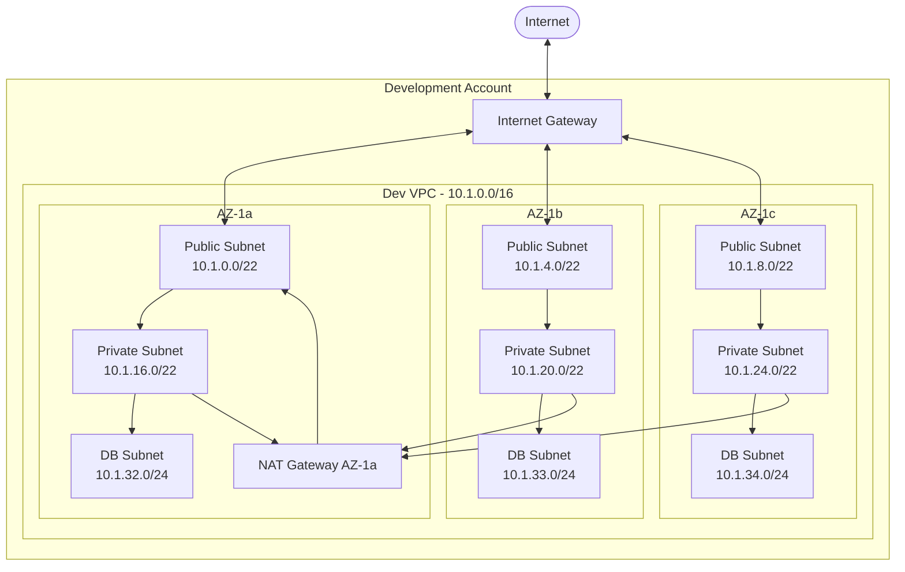
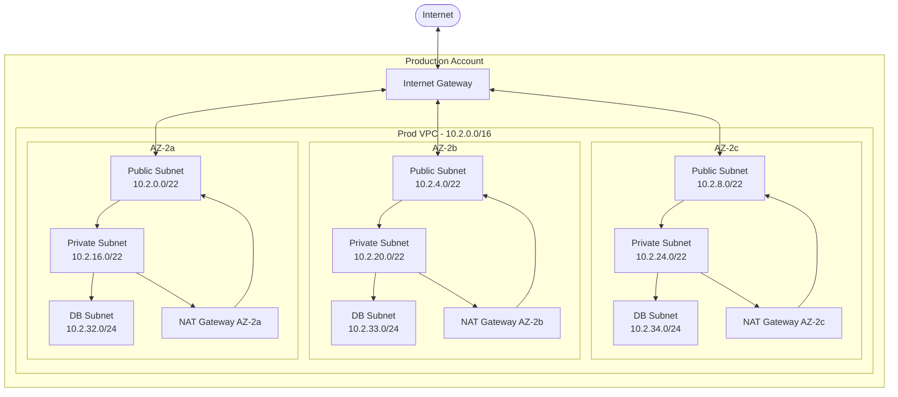

# VPC Network Architecture Guide

## Overview

This document provides a comprehensive guide for designing and implementing secure, scalable VPC networks across your AWS multi-account organization. Following AWS Well-Architected Framework principles, this architecture focuses on security, cost optimization, and high availability.

**Prerequisites:**

- AWS Organization with IAM Identity Center configured
- Development and Production accounts established
- Cross-account IAM roles with appropriate networking permissions

This guide assumes your multi-account organization is already in place and focuses specifically on networking design and implementation.

## Table of Contents

1. [Network Architecture Overview](#network-architecture-overview)
2. [CIDR Block Planning](#cidr-block-planning)
3. [VPC Design Principles](#vpc-design-principles)
4. [Development Environment VPC](#development-environment-vpc)
5. [Production Environment VPC](#production-environment-vpc)
6. [Network Security](#network-security)
7. [Monitoring and Troubleshooting](#monitoring-and-troubleshooting)
8. [Cost Optimization](#cost-optimization)

## Network Architecture Overview

### Development Account VPC



### Production Account VPC



## CIDR Block Planning

### Overall Network Allocation

| Environment      | VPC CIDR                   | Available IPs | Purpose                 |
| ---------------- | -------------------------- | ------------- | ----------------------- |
| Development      | 10.1.0.0/16                | 65,534        | Dev/Test workloads      |
| Production       | 10.2.0.0/16                | 65,534        | Production workloads    |
| Future Expansion | 10.3.0.0/16 - 10.10.0.0/16 | -             | Additional environments |

### Subnet Allocation Strategy

#### Development VPC (10.1.0.0/16)

```yaml
Public Subnets: 10.1.0.0/22 - 10.1.8.0/22 (3,072 IPs)
Private Subnets: 10.1.16.0/22 - 10.1.24.0/22 (3,072 IPs)
Database Subnets: 10.1.32.0/24 - 10.1.34.0/24 (768 IPs)
Reserved: 10.1.35.0/24 - 10.1.255.0/24 (Future use)
```

#### Production VPC (10.2.0.0/16)

```yaml
Public Subnets: 10.2.0.0/22 - 10.2.8.0/22 (3,072 IPs)
Private Subnets: 10.2.16.0/22 - 10.2.24.0/22 (3,072 IPs)
Database Subnets: 10.2.32.0/24 - 10.2.34.0/24 (768 IPs)
Reserved: 10.2.35.0/24 - 10.2.255.0/24 (Future use)
```

## VPC Design Principles

### 1. Security by Design

- **Network Segmentation**: Separate tiers for web, application, and database
- **Defense in Depth**: Multiple layers of security controls
- **Least Privilege**: Minimal required access through security groups and NACLs

### 2. High Availability

- **Multi-AZ Deployment**: Resources distributed across 3 availability zones
- **Environment-Specific NAT Strategy**: Single NAT Gateway for development, multiple NAT Gateways for production
- **Cross-AZ Load Balancing**: Application Load Balancers across all AZs

### 3. Scalability

- **Elastic Infrastructure**: Auto-scaling groups and ECS services
- **Reserved Capacity**: Ample IP address space for growth
- **Modular Design**: Reusable components across environments

### 4. Cost Optimization

- **Efficient Resource Utilization**: Right-sized NAT gateways and load balancers
- **Reserved Instances**: Cost savings for predictable workloads
- **Data Transfer Optimization**: Strategic placement of resources

## Development Environment VPC

### Development Architecture Overview

The Development environment includes:

#### Development Core Components

- **VPC**: 10.1.0.0/16 CIDR block with DNS hostname and resolution enabled
- **Public Subnets**: 3 subnets across AZs (10.1.0.0/22, 10.1.4.0/22, 10.1.8.0/22) - 1024 IPs each
- **Private Subnets**: 3 subnets across AZs (10.1.16.0/22, 10.1.20.0/22, 10.1.24.0/22) - 1024 IPs each
- **Database Subnets**: 3 subnets across AZs (10.1.32.0/24, 10.1.33.0/24, 10.1.34.0/24) - 256 IPs each
- **Internet Gateway**: For public internet access
- **NAT Gateway**: Single NAT Gateway in AZ-1a for cost optimization
- **Route Tables**: Configured for proper traffic routing between tiers

#### Cost Optimization Features

- **Single NAT Gateway**: Deployed in AZ-1a to minimize costs for development workloads
- **Cross-AZ Traffic**: Private subnets in AZ-1b and AZ-1c route through AZ-1a NAT Gateway
- **Acceptable Risk**: Reduced redundancy is acceptable for non-production environment

#### Development Resource Tagging Strategy

All resources are tagged with:

- **Name**: Descriptive resource identifier
- **Project**: $PROJECT_NAME
- **Environment**: development
- **ManagedBy**: terraform
- **Owner**: engineering-team

## Production Environment VPC

### Production Architecture Overview

The Production environment includes:

#### Production Core Components

- **VPC**: 10.2.0.0/16 CIDR block with DNS hostname and resolution enabled
- **Public Subnets**: 3 subnets across AZs (10.2.0.0/22, 10.2.4.0/22, 10.2.8.0/22) - 1024 IPs each
- **Private Subnets**: 3 subnets across AZs (10.2.16.0/22, 10.2.20.0/22, 10.2.24.0/22) - 1024 IPs each
- **Database Subnets**: 3 subnets across AZs (10.2.32.0/24, 10.2.33.0/24, 10.2.34.0/24) - 256 IPs each
- **Internet Gateway**: For public internet access
- **NAT Gateways**: 3 NAT Gateways (one per AZ) for high availability and fault tolerance
- **Route Tables**: Configured for proper traffic routing between tiers

#### Enhanced Production Features

- **Multi-AZ High Availability**: All critical components deployed across 3 availability zones
- **Dedicated NAT Gateways**: One per AZ for maximum fault tolerance and performance
- **Enhanced Tagging**: Includes tier-specific tags (web/app/data) for operational clarity
- **Production-Grade Security**: Isolated security groups and NACLs per tier

#### Production Resource Tagging Strategy

All resources are tagged with:

- **Name**: Descriptive resource identifier
- **Project**: $PROJECT_NAME
- **Environment**: production
- **ManagedBy**: terraform
- **Owner**: engineering-team

## Network Security

### Security Architecture Overview

Network security is implemented using a defense-in-depth approach with multiple layers of protection:

#### Security Groups (Application-Level Firewall)

- **Web Tier Security Group**: Allows HTTP (80) and HTTPS (443) traffic from internet
- **Application Tier Security Group**: Allows traffic only from Web Tier on application ports
- **Database Tier Security Group**: Allows PostgreSQL (5432) traffic only from Application Tier

#### Network Access Control Lists (NACLs)

- **Public Subnet NACL**: Controls traffic to/from public subnets at subnet level
- **Private Subnet NACL**: Provides additional layer of security for application workloads
- **Database Subnet NACL**: Restricts database traffic to essential communications only

#### VPC Flow Logs

- **Comprehensive Logging**: All traffic (ACCEPT, REJECT, ALL) captured
- **CloudWatch Integration**: Logs stored in CloudWatch with 30-day retention
- **Security Monitoring**: Enables detection of suspicious network activity

### Security Best Practices

#### Network Segmentation

- **Three-Tier Architecture**: Web, Application, and Database tiers isolated
- **Subnet-Level Isolation**: Each tier deployed in dedicated subnets
- **Cross-AZ Distribution**: Resources spread across multiple availability zones

#### Access Control

- **Least Privilege Principle**: Security groups allow only required traffic
- **Source-Based Rules**: Application tier only accepts traffic from web tier
- **Port-Specific Rules**: Database access restricted to specific ports and sources

#### Monitoring and Compliance

- **VPC Flow Logs**: Network traffic monitoring and analysis
- **CloudWatch Integration**: Real-time monitoring and alerting
- **Security Auditing**: Regular review of security group and NACL rules

## Monitoring and Troubleshooting

### Monitoring Strategy Overview

Network monitoring is implemented through comprehensive observability tools and practices:

#### CloudWatch Integration

- **VPC Flow Logs**: Comprehensive network traffic analysis and security monitoring
- **NAT Gateway Metrics**: Bandwidth utilization, connection tracking, and cost optimization
- **Custom Dashboards**: Real-time visualization of network performance and health

#### Network Insights and Analysis

- **VPC Reachability Analyzer**: Automated connectivity testing between resources
- **Network Performance Monitoring**: Latency and throughput analysis across availability zones
- **Security Analysis**: Automated detection of unusual traffic patterns

### Troubleshooting Tools and Practices

#### Common Network Issues

- **Connectivity Problems**: Route table misconfiguration, security group rules
- **Performance Issues**: NAT Gateway bandwidth limits, cross-AZ traffic
- **Security Concerns**: Unexpected traffic patterns, access violations

#### Diagnostic Capabilities

- **VPC Flow Logs Analysis**: Traffic flow investigation and security auditing
- **CloudWatch Metrics**: Real-time monitoring of network components
- **AWS X-Ray Integration**: Application-level network performance tracing

## Cost Optimization

### NAT Gateway Cost Strategy

#### Multi-Environment Approach

- **Development Environment**: Single NAT Gateway in AZ-1a for cost optimization
- **Production Environment**: 3 NAT Gateways for high availability and fault tolerance
- **Cost Monitoring**: CloudWatch billing alerts and usage tracking

#### Development Cost Benefits

- **67% Cost Reduction**: Single NAT Gateway reduces NAT Gateway costs from 3 to 1
- **Cross-AZ Data Transfer**: Minimal impact as dev workloads are typically light
- **Acceptable Risk**: Single point of failure acceptable for non-production environment
- **Easy Scaling**: Can add additional NAT Gateways if needed for higher availability

#### VPC Endpoints for Cost Reduction

- **S3 Gateway Endpoint**: Free gateway endpoint for S3 access (no NAT Gateway charges)
- **ECR Interface Endpoints**: Reduce container image pull costs through private connectivity
- **Other AWS Services**: Implement endpoints for frequently used services

### Cost Optimization Best Practices

#### Data Transfer Optimization

- **Cross-AZ Traffic**: Minimize unnecessary cross-AZ data transfer
- **VPC Endpoint Usage**: Route AWS service traffic through VPC endpoints
- **NAT Gateway Monitoring**: Track and optimize outbound internet traffic

#### Resource Right-Sizing

- **NAT Gateway Sizing**: Monitor utilization and adjust if needed
- **Subnet Allocation**: Efficient IP address utilization strategy
- **Reserved Capacity**: Consider Reserved Instances for predictable workloads

## References

- [AWS VPC User Guide](https://docs.aws.amazon.com/vpc/)
- [AWS Well-Architected Framework - Security Pillar](https://docs.aws.amazon.com/wellarchitected/latest/security-pillar/)
- [VPC Network ACLs](https://docs.aws.amazon.com/vpc/latest/userguide/vpc-network-acls.html)
- [VPC Security Groups](https://docs.aws.amazon.com/vpc/latest/userguide/VPC_SecurityGroups.html)
