# Infrastructure Architecture

## Goal

This document shows the application infrastructure flow: **CloudFront → ALB → ECS Fargate → RDS** and how components are organized in different subnets for security.

## Table of Contents

1. [Architecture Diagram](#architecture-diagram)
2. [Infrastructure Components](#infrastructure-components)
3. [Application Flow](#application-flow)
4. [Security Layers](#security-layers)
5. [Environment Configurations](#environment-configurations)
6. [References](#references)

## Architecture Diagram

```mermaid
graph TB
    subgraph "Internet"
        Users[👥 Users]
        WAF1[🛡️ AWS WAF]
        CloudFront[☁️ CloudFront CDN]
    end

    subgraph "AWS VPC"
        subgraph "Public Subnet"
            WAF2[🛡️ AWS WAF]
            ALB[🔄 Application Load Balancer]
        end

        subgraph "Private Subnet - Application Tier"
            ECS[🐳 ECS Fargate Containers<br/>MVC Web Application]
        end

        subgraph "Database Subnet - Database Tier"
            RDS[🗄️ RDS PostgreSQL<br/>Multi-AZ Deployment]
        end
    end

    Users --> WAF1
    WAF1 --> CloudFront
    CloudFront --> WAF2
    WAF2 --> ALB
    ALB --> ECS
    ECS --> RDS
```

## Infrastructure Components

### AWS WAF (Web Application Firewall)

**CloudFront WAF Protection:**

- **What**: First line of defense filtering malicious requests before they reach CloudFront
- **Features**: OWASP Top 10 protection, rate limiting, geo-blocking, bot detection
- **Rules**: Common attack patterns, SQL injection prevention, XSS filtering

**ALB WAF Protection:**

- **What**: Secondary security layer ensuring only legitimate CloudFront requests reach the ALB
- **Origin Verification**: Uses `X-Origin-Verify` custom header to validate requests come from CloudFront
- **Why Critical**: Prevents direct access to ALB, ensures all traffic flows through CloudFront security policies

### CloudFront CDN

- **What**: Global content delivery network with 400+ edge locations worldwide
- **Caching Strategy**: Static assets cached at edge, dynamic content accelerated through optimized routing
- **Security Features**: Built-in DDoS protection, SSL/TLS termination, custom security headers
- **Origin Shield**: Additional caching layer to reduce load on ALB origin
- **Header Injection**: Adds `X-Origin-Verify` header to authenticate requests to ALB

### Application Load Balancer (Public Subnet)

- **What**: Layer 7 load balancer distributing HTTP/HTTPS traffic across ECS tasks
- **Target Groups**: Health check configuration for ECS Fargate tasks on port 8080
- **SSL/TLS**: Certificate management via AWS Certificate Manager (ACM)
- **Security Groups**: Restricted to accept traffic only from CloudFront IP ranges
- **Origin Verification**: WAF rules validate `X-Origin-Verify` header from CloudFront

### ECS Fargate (Private Subnet)

- **What**: Serverless container platform running containerized MVC web applications
- **Task Definition**: CPU and memory allocation, environment variables, secrets management
- **Auto Scaling**: Target tracking policies based on CPU utilization and ALB request count
- **Service Discovery**: AWS Cloud Map integration for internal service communication
- **Networking**: No public IP assignment, outbound internet via NAT Gateway for updates/APIs

### RDS PostgreSQL (Database Subnet)

- **What**: Managed relational database with automated operations and Multi-AZ deployment
- **High Availability**: Synchronous replication to standby instance in different AZ
- **Backup Strategy**: Automated daily backups with 7-day retention, point-in-time recovery
- **Security**: Encryption at rest (KMS), encryption in transit (SSL), isolated in database subnets
- **Performance**: Parameter group optimization, Performance Insights monitoring

## Application Flow

1. **Users** access the application through their browsers
2. **AWS WAF** filters malicious traffic before reaching CloudFront
3. **CloudFront** serves cached content and forwards dynamic requests
4. **AWS WAF** provides additional filtering before reaching ALB
5. **ALB** (in public subnet) receives requests and performs health checks
6. **ECS Fargate** (in private subnet) processes application logic
7. **RDS PostgreSQL** (in database subnet) handles data persistence with automatic failover

## Security Layers

### Network Isolation

- **Public Subnet**: Only ALB exposed to internet, restricted security groups
- **Private Subnet**: ECS containers isolated, no direct internet access, outbound via NAT Gateway
- **Database Subnet**: RDS completely isolated, only accessible from application tier

### Origin Verification

- **X-Origin-Verify Header**: Custom header added by CloudFront to validate legitimate requests
- **WAF Rules**: ALB WAF validates presence and value of X-Origin-Verify header
- **IP Restriction**: ALB security groups only allow CloudFront IP ranges

### Data Protection

- **Encryption in Transit**: SSL/TLS for all communications (CloudFront, ALB, RDS)
- **Encryption at Rest**: RDS encryption using AWS KMS, ECS task storage encryption
- **Secrets Management**: AWS Secrets Manager for database credentials and API keys

## Environment Configurations

### Production Environment

- **High Availability**: Multi-AZ deployment across 3 availability zones
- **Auto Scaling**: 2-10 ECS tasks based on CPU utilization and ALB request count
- **Database**: RDS Multi-AZ with automated failover, 7-day backup retention
- **Monitoring**: CloudWatch dashboards, detailed logging, performance alerts
- **Security**: Full WAF rule sets, strict security groups, comprehensive logging

### Development Environment

- **Cost Optimized**: Single AZ deployment to minimize costs
- **Auto Scaling**: 1-3 ECS tasks maximum, aggressive scale-down policies
- **Database**: RDS Multi-AZ for testing failover scenarios, 1-day backup retention
- **Monitoring**: Basic CloudWatch metrics, essential alerts only
- **Security**: Simplified WAF rules, development-appropriate access controls

## References

- [AWS Well-Architected Framework](https://aws.amazon.com/architecture/well-architected/)
- [Amazon CloudFront Origin Verification](https://docs.aws.amazon.com/AmazonCloudFront/latest/DeveloperGuide/add-origin-custom-headers.html)
- [AWS WAF Developer Guide](https://docs.aws.amazon.com/waf/latest/developerguide/)
- [Amazon ECS Best Practices Guide](https://docs.aws.amazon.com/AmazonECS/latest/bestpracticesguide/)
- [Amazon RDS Best Practices](https://docs.aws.amazon.com/AmazonRDS/latest/UserGuide/CHAP_BestPractices.html)
- [Application Load Balancer User Guide](https://docs.aws.amazon.com/elasticloadbalancing/latest/application/)
- [ECS Fargate Security Best Practices](https://aws.amazon.com/blogs/containers/securing-amazon-ecs-workloads-with-aws-fargate/)
- [CloudFront Security Headers](https://docs.aws.amazon.com/AmazonCloudFront/latest/DeveloperGuide/adding-response-headers.html)
