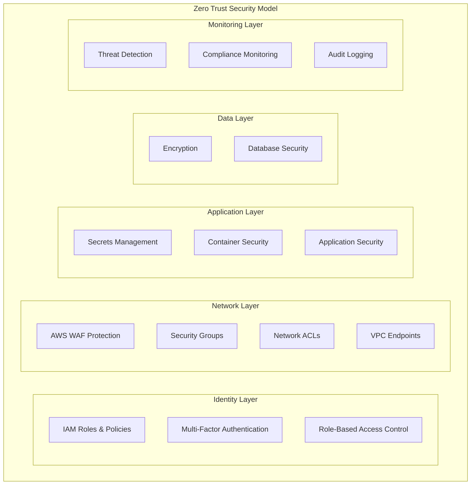

# Security Architecture

## Goal

This document establishes our comprehensive security framework following least privilege principles and zero trust architecture. It provides security patterns, guidelines, and compliance requirements rather than specific implementations, which will be defined during the detailed design phase.

## Table of Contents

1. [Security Framework Overview](#security-framework-overview)
2. [Network Security Patterns](#network-security-patterns)
3. [Identity and Access Management Strategy](#identity-and-access-management-strategy)
4. [Secrets Management Strategy](#secrets-management-strategy)
5. [Container Security Guidelines](#container-security-guidelines)
6. [Data Protection Requirements](#data-protection-requirements)
7. [Security Monitoring and Compliance](#security-monitoring-and-compliance)
8. [Implementation Notes](#implementation-notes)
9. [References](#references)

## Security Framework Overview

### Zero Trust Principles

Our security model is built on five core zero trust principles:

1. **Never Trust, Always Verify**: Authenticate and authorize every request regardless of location
2. **Least Privilege Access**: Grant minimum necessary permissions for specific tasks
3. **Assume Breach**: Design systems assuming compromise has occurred
4. **Verify Explicitly**: Use identity, device, location, and behavioral context
5. **Continuous Monitoring**: Real-time threat detection and automated response

### Security Architecture Layers



## Network Security Patterns

### Three-Tier Security Model

Our network security follows a three-tier isolation model:

- **Public Subnet (DMZ)**: Only load balancers exposed to internet
- **Private Subnet (Application Tier)**: Application containers with no direct internet access
- **Database Subnet (Data Tier)**: Database instances completely isolated from internet

### Security Groups (Stateful Firewall) - Design Patterns

#### Web Tier Security Group Pattern

```yaml
Purpose: Protect internet-facing load balancers
Ingress Rules:
  - HTTP (port 80) from CloudFront IP ranges only
  - HTTPS (port 443) from CloudFront IP ranges only
  - Deny all other inbound traffic

Egress Rules:
  - <applicationPort> to Application Tier Security Group
  - HTTPS (port 443) to internet for health checks and AWS APIs
```

#### Application Tier Security Group Pattern

```yaml
Purpose: Protect application containers
Ingress Rules:
  - <applicationPort> from Web Tier Security Group only
  - Deny all other inbound traffic

Egress Rules:
  - <databasePort> to Database Tier Security Group
  - HTTPS (port 443) to internet for AWS APIs and external services
  - DNS (port 53) for name resolution
```

#### Database Tier Security Group Pattern

```yaml
Purpose: Protect database instances
Ingress Rules:
  - <databasePort> from Application Tier Security Group only
  - Deny all other inbound traffic

Egress Rules:
  - Ephemeral ports back to Application Tier Security Group
  - (RDS managed instances typically don't require explicit egress rules)
```

### Network ACLs (Stateless Firewall) - AWS Recommended Patterns

#### Public Subnet NACL Pattern

```yaml
Ingress Rules (numbered 100, 110, etc.):
  - HTTP (80) from 0.0.0.0/0
  - HTTPS (443) from 0.0.0.0/0
  - Ephemeral ports (1024-65535) from <vpcCidrBlock>
  - DENY ALL (rule 32767)

Egress Rules:
  - <applicationPort> to <vpcCidrBlock>
  - HTTPS (443) to 0.0.0.0/0
  - Ephemeral ports (1024-65535) to 0.0.0.0/0
  - DENY ALL (rule 32767)
```

#### Private Subnet NACL Pattern

```yaml
Ingress Rules:
  - <applicationPort> from <vpcCidrBlock>
  - Ephemeral ports (1024-65535) from 0.0.0.0/0 (for return traffic)
  - DENY ALL (rule 32767)

Egress Rules:
  - <databasePort> to <vpcCidrBlock>
  - HTTPS (443) to 0.0.0.0/0 (for AWS APIs)
  - Ephemeral ports (1024-65535) to <vpcCidrBlock>
  - DENY ALL (rule 32767)
```

#### Database Subnet NACL Pattern

```yaml
Ingress Rules:
  - <databasePort> from <vpcCidrBlock>
  - DENY ALL (rule 32767)

Egress Rules:
  - Ephemeral ports (1024-65535) to <vpcCidrBlock>
  - DENY ALL (rule 32767)
```

### VPC Endpoints Strategy

Implement VPC endpoints for all AWS services to eliminate internet traffic:

- **Secrets Manager**: For credential retrieval
- **SSM Parameter Store**: For configuration access
- **ECR**: For container image pulls
- **CloudWatch**: For logging and metrics
- **S3**: For static assets (if used)

## Identity and Access Management Strategy

### Least Privilege Principle

All IAM roles and policies must follow the principle of least privilege:

#### Container Execution Roles

```yaml
ECS Task Execution Role (Infrastructure):
  - ECR image pulling permissions
  - CloudWatch log creation
  - Secrets Manager read access for runtime secrets
  - Limited to specific resource ARNs

ECS Task Role (Application Runtime):
  - SSM Parameter Store read access for configuration
  - CloudWatch metrics publishing
  - S3 access (if required for application data)
  - X-Ray tracing permissions
  - Limited to specific resource ARNs and conditions
```

#### Resource-Based Access Patterns

- **Secrets Manager**: Resource policies restricting access to specific roles
- **S3 Buckets**: Bucket policies with IP and role restrictions
- **RDS**: Database-level users with minimal required permissions
- **Parameter Store**: Path-based access control with KMS encryption

### Cross-Service Access Controls

#### Condition-Based Policies

All IAM policies should include relevant conditions:

- **aws:RequestedRegion**: Limit to approved regions
- **aws:SecureTransport**: Require HTTPS/TLS
- **aws:PrincipalTag**: Role-based access control
- **aws:CurrentTime**: Time-based access restrictions

## Secrets Management Strategy

### AWS Secrets Manager vs SSM Parameter Store

#### AWS Secrets Manager (For Sensitive Data)

**Use For:**

- Database credentials with automatic rotation
- API keys for external services
- SSL/TLS certificates
- OAuth tokens and secrets

**Key Features:**

- Automatic rotation capabilities
- Cross-region replication
- Fine-grained access control
- Audit trail integration

#### SSM Parameter Store (For Configuration)

**Use For:**

- Application configuration parameters
- Feature flags and toggles
- Non-sensitive environment variables
- Application settings

**Key Features:**

- SecureString type with KMS encryption
- Parameter hierarchies for organization
- Cost-effective for configuration data
- Version history and rollback

### Secret Naming Conventions

```yaml
Secrets Manager:
  - Pattern: /<environment>/<application>/<component>/<secret-type>
  - Examples: /prod/webapp/database/credentials
      /prod/webapp/external/payment-api-key

SSM Parameter Store:
  - Pattern: /<application>/<environment>/<component>/<parameter>
  - Examples: /webapp/prod/app/max-connections
      /webapp/prod/features/new-checkout-enabled
```

### Access Patterns

#### Secret Rotation Strategy

- **Database Credentials**: Automatic 30-day rotation
- **API Keys**: Manual quarterly rotation with notification
- **Certificates**: Automatic renewal via ACM when possible
- **Application Secrets**: Manual rotation based on security requirements

## Container Security Guidelines

### Image Security

#### Base Image Requirements

- Use official, minimal base images (Alpine, Distroless)
- Implement multi-stage builds to reduce attack surface
- Regular vulnerability scanning with ECR image scanning
- Image signing and verification for production deployments

#### Container Runtime Security

```yaml
Security Context Requirements:
  - Run as non-root user (UID > 1000)
  - Read-only root filesystem where possible
  - Drop all Linux capabilities unless specifically required
  - Enable init process for proper signal handling
  - Resource limits (CPU, memory) to prevent DoS
```

#### Container Networking

- No privileged containers in production
- Host network mode prohibited
- Container-to-container communication via service discovery
- All external communication through controlled egress rules

### Image Lifecycle Management

#### ECR Repository Configuration

- **Image Scanning**: Scan on push enabled
- **Encryption**: KMS encryption for images at rest
- **Lifecycle Policies**: Retain only required image versions
- **Access Control**: Repository-level IAM policies

## Data Protection Requirements

### Encryption Standards

#### Encryption at Rest

- **RDS Databases**: AWS KMS encryption required
- **EBS Volumes**: Default encryption enabled
- **S3 Buckets**: Server-side encryption with KMS
- **Parameter Store**: SecureString parameters with KMS
- **Secrets Manager**: Default KMS encryption

#### Encryption in Transit

- **ALB to Client**: TLS 1.2 minimum via ACM certificates
- **ALB to Containers**: HTTP within VPC (private network)
- **Container to RDS**: SSL/TLS connections required
- **Container to AWS APIs**: HTTPS required via VPC endpoints

### Key Management Strategy

#### KMS Key Usage Patterns

- **Application-specific keys**: Separate keys per application/environment
- **Service-specific keys**: Dedicated keys for RDS, EBS, S3
- **Rotation policy**: Annual key rotation for long-term keys
- **Access control**: Resource-based key policies with conditions

## Security Monitoring and Compliance

### AWS Security Services Integration

#### AWS Config Rules (Compliance Monitoring)

**Essential Rules:**

- Encrypted storage volumes required
- RDS encryption enabled
- S3 bucket public write prohibited
- Security group SSH access restricted
- ECS task definition non-root user required
- Root access key usage prohibited

#### AWS Security Hub (Centralized Security)

**Enabled Standards:**

- AWS Foundational Security Standard
- CIS AWS Foundations Benchmark
- PCI DSS (if applicable)
- Custom security standards for application requirements

#### Amazon GuardDuty (Threat Detection)

**Monitoring Capabilities:**

- Malicious IP communication detection
- Cryptocurrency mining detection
- Data exfiltration monitoring
- Compromised instance detection
- Suspicious DNS requests

### Audit and Compliance Logging

#### AWS CloudTrail Configuration

**Logging Requirements:**

- All API calls across all regions
- Data events for sensitive S3 buckets
- Management events for all services
- Log file integrity validation
- Centralized logging to dedicated audit account

#### Application Security Logging

**Required Log Events:**

- Authentication attempts (success/failure)
- Authorization decisions
- Data access patterns
- Configuration changes
- Security-relevant application events

### Security Metrics and KPIs

#### Security Performance Indicators

- **Mean Time to Detection (MTTD)**: Target < 15 minutes
- **Mean Time to Response (MTTR)**: Target < 30 minutes
- **Failed Authentication Rate**: Target < 1%
- **Security Rule Compliance**: Target > 95%
- **Vulnerability Remediation Time**: Target < 72 hours
- **Secrets Rotation Compliance**: Target 100%

## Implementation Notes

### Technology-Agnostic Placeholders

The following placeholders are used throughout this document and must be replaced during implementation:

- **`<vpcCidrBlock>`**: VPC CIDR block from network architecture
- **`<applicationPort>`**: Application container listening port
- **`<databasePort>`**: Database service port (e.g., 5432 for PostgreSQL)
- **`<environment>`**: Environment identifier (prod, staging, dev)
- **`<application>`**: Application name
- **`<component>`**: Application component name

### Implementation Phases

#### Phase 1: Foundation Security

1. Implement basic IAM roles with least privilege
2. Configure Security Groups and NACLs
3. Set up VPC endpoints for essential services
4. Enable basic monitoring (CloudTrail, Config)

#### Phase 2: Application Security

1. Implement secrets management strategy
2. Configure container security policies
3. Set up application-level monitoring
4. Enable Security Hub and GuardDuty

#### Phase 3: Advanced Security

1. Implement automated security response
2. Fine-tune security monitoring and alerting
3. Set up compliance reporting
4. Establish security incident response procedures

### Compliance Considerations

#### Industry Standards Alignment

- **SOC 2 Type II**: Focus on security, availability, processing integrity
- **ISO 27001**: Information security management system
- **NIST Cybersecurity Framework**: Identify, protect, detect, respond, recover
- **GDPR**: Data protection and privacy requirements (if applicable)

### Security Testing Requirements

#### Regular Security Assessments

- **Quarterly vulnerability scans**: All infrastructure and applications
- **Annual penetration testing**: External security assessment
- **Monthly compliance audits**: Config rule compliance review
- **Continuous security monitoring**: Real-time threat detection and response

## References

- [AWS Security Best Practices](https://aws.amazon.com/architecture/security-identity-compliance/)
- [AWS Well-Architected Security Pillar](https://docs.aws.amazon.com/wellarchitected/latest/security-pillar/)
- [Zero Trust Architecture NIST SP 800-207](https://csrc.nist.gov/publications/detail/sp/800-207/final)
- [AWS Config Rules Reference](https://docs.aws.amazon.com/config/latest/developerguide/managed-rules-by-aws-config.html)
- [AWS Security Hub User Guide](https://docs.aws.amazon.com/securityhub/latest/userguide/)
- [Amazon GuardDuty User Guide](https://docs.aws.amazon.com/guardduty/latest/ug/)
- [AWS Secrets Manager Best Practices](https://docs.aws.amazon.com/secretsmanager/latest/userguide/best-practices.html)
- [Container Security Best Practices](https://aws.amazon.com/blogs/containers/securing-amazon-ecs-workloads-with-aws-fargate/)
